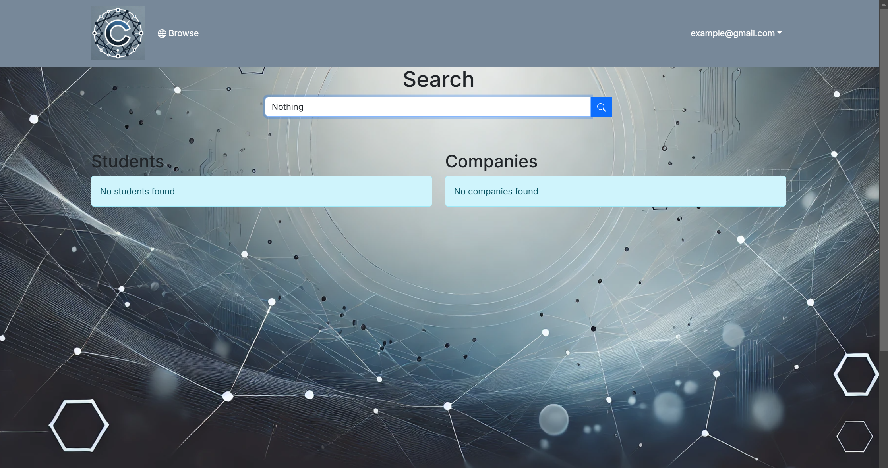

## Table of contents

* [Overview](#overview)
* [Approach](#approach)
* [User guide](#user-guide)
* [Example enhancements](#example-enhancements)
* [Team](#team)
* [Team Contract](#team-contract)
* [Milestone](#milestone)
* [Milestone 1 Progress](#milestone-1-screenshots-of-progress)
* [Deployment](#deployment)

## Overview

The Corponector web application provides a new way for local and non-local companies who want to recruit students from UH to make their (potential) opportunities known to students. At the same time, students can create profiles on the site with their interests. The site can match students to employers and vice-versa.

* [GitHub Organization](https://github.com/corponector) of Corponector containing all its repositories.

Technologies we plan on using for "Corponector":

* [React](https://reactjs.org/) for component-based UI implementation and routing.
* [Nextjs](https://nextjs.org/) to enhance the development process, particularly for full-stack applications. It adds additional tools for server-side rendering (SSR), static site generation (SSG), API routes, and more.
* [PostgreSQL](https://postgresql.org/) to handle structured data with well-defined schemas and relationships between entities.

### Project Goals

The primary goals of this project are to:
- **Enhance Job and Internship Visibility**: Make it easy for students to explore a wide range of opportunities from numerous companies.
- **Streamline Connections**: Allow companies to post details about potential positions and recruit students with the necessary skills and interests.
- **Match Skills and Interests**: Enable students to create profiles with their skills and career preferences, while companies can specify the skills they look for in candidates.
- **Support Admin Oversight**: Provide administrators with the ability to monitor site content, add new skill or location categories, and manage the platform.

## Approach

### Features

The **Corponector** application will deliver the following key features:

- **Company Profiles**: Companies can showcase their mission, location, recruiting needs, job descriptions, and relevant links. This enables students to understand the company's focus and the roles available.
  
- **Student Profiles**: Students can create profiles highlighting their skills, geographic preferences, and portfolio links, providing employers with a quick snapshot of their qualifications.
  
- **Matchmaking Capabilities**: The system will allow companies and students to be matched based on mutual interests, skills, and locations, helping students find opportunities that align with their career goals.

- **Admin Portal**: Administrators can monitor content, create new skill and location categories, and ensure a safe and professional platform environment.

### System Overview

The **Corponector** system will be built to serve three primary user roles:

- **Students**: Students can browse company profiles, set up their own profiles, and connect with companies based on their skills and location preferences.
- **Companies**: Companies can create profiles to post potential opportunities and manage recruitment needs for UH students.
- **Administrators**: Admins can oversee the platform, moderate content, and manage platform categories and settings.

After logging in, users will have access to personalized home pages where they can explore matches, set up their profiles, and navigate the platform based on their role.

## User guide

Here are some mockup designs to illustrate the planned structure and user experience of the **Corponector** platform. 

### Landing Page

On the **Landing Page**, users can easily sign in or register by clicking the  **"Log In"** or **"Sign Up"** buttons located at the top right corner. New users can register by providing basic information such as their name, email, and role (student or company), while returning users can simply enter their credentials to access their personalized dashboard and start browsing opportunities or managing job postings.

### Student Home/Profile Page

The **Student Home Page** displays job opportunities tailored to a student's skills, interests, and preferred locations, allowing them to browse and apply for internships and positions. Students can update their profiles to showcase their qualifications and increase their chances of matching with potential employers.

It also allows students to showcase their skills, interests, and professional experience, including a link to their portfolio. It provides a personalized view of their qualifications, making it easier for companies to find and connect with them for relevant job opportunities.

### Company Home/Profile Page

The **Company Home Page** allows companies to manage their job postings and view candidates who match their required skills and location preferences. Companies can send messages to potential hires, update job listings, and track engagement with student profiles to find the best talent for their positions.

It showcases the company’s details, including an overview, location, job postings, and key contact information. Companies can update their profile, manage available positions, and track engagement with student applicants to attract the right talent.

### Admin Home Page

The **Admin Home Page** provides a centralized dashboard for managing job postings, user accounts, and ensuring content moderation across the platform. Admins can generate analytics and reports, manage categories and settings, and monitor site activity to maintain a smooth and organized user experience.

### Browse Companies and Users

The **Browse Companies and Users** page allows students and employers to filter and search for companies and candidates based on specific criteria such as skills, geographic location, and job type. This feature helps users easily find matches that align with their professional interests or hiring needs.

 
## Example Enhancements

* Notifications via email and/or SMS.

## Team
* [Amy Shin](https://tlsdbfla00.github.io/)
* [Alexis Karl Buted](https://abuted.github.io/)
* [Alessandra Gudoy](https://alessandra-gudoy.github.io/)
* [Blake Ilagan](https://byilagan808.github.io/Professional-Portfolio-/)
* [Justine Ponce](https://justonepg.github.io/JustinePonce.github.io/)

## Team Contract

## Milestone
* [Milestone 1](https://github.com/orgs/corponector/projects/1/views/1)
* [Milestone 2](https://github.com/orgs/corponector/projects/3)

## Milestone 1: Screenshots of Progress
Landing Page:

Sign In Page:

Sign Up Page:

If registering a student profile:

If registering a company profile:

Student Profile Page:

Search Page:

Company Home Page:

## Deployment
* [Vercel](https://corponector.vercel.app/)

